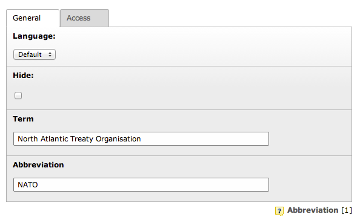

.. ==================================================
.. FOR YOUR INFORMATION
.. --------------------------------------------------
.. -*- coding: utf-8 -*- with BOM.

.. include:: ../Includes.txt
.. include:: Images.txt

.. _user-manual:

Users Manual
============

Target group: **Editors**

Abbreviation Record
"""""""""""""""""""

Abbreviation records are used to define an abbreviation and the corresponding expression.
The records can be created on any page, however a sysfolder is often preferred.

